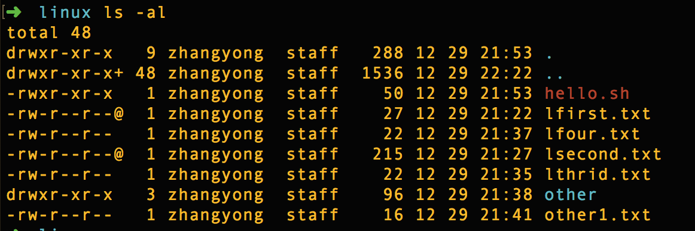

## Linux下文件的读写权限问题

如下图，我们使用ls -al可查看文件夹及文件的权限问题

    

----

##### 类型

 "-"：表示文件类型

-：普通文件    d:目录    c:字符设备     s:套接字    p:管道    b: 块设备       l:  链接

+ "rw-r--r--": 表示文件的权限

1. 前三个字母“rw-”表示文件拥有者的权限

2. 中间三个字母“r--”表示文件所属组的权限

3. 后三个字母“r--”表示文件对于其他人的权限

+ "9"：对于文件表示文件内容被系统记录的次数

  ​         对于目录表示目录中文件属性的字节数

+ "zhangyong"：文件的拥有者

+ "staff"：文件所属的组

+ "288"：表示文件的大小

+ "12 29 21:53"：文件最后一次修改的时间

+ "Hello.sh"：文件名

---

##### 权限

rw- | r-- | r--  

  u       g     o

u：文件的拥有者对文件可以读写

g:文件组成员对文件可读

o :其他人对文件可读

+ r权限

对于文件：可以查看文件的字符

对于目录：可以查看目录中的文件信息

+ w权限

对于文件：可以更改文件内的字符

对于目录：可以在目录中添加删除文件

+ x权限

对于文件：可以运行文件内记录的程序动作

对于目录：可以进入目录

---

##### 修改权限

下面介绍数字方式修改权限

rw- | r-- | r--  

u       g     o

u=rw=4+2+0=6

g=r--=4+0+0=4

o=r--=4+0+0=4

r=4    w=2   x=1

数字方式修改文件权限的命令：chmod  修改后的权限  filename

chmod   777  filename

文件夹：drwxrwxrwx

文件：     -rwxrwxrwx

